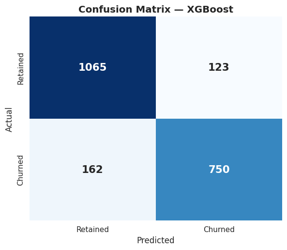
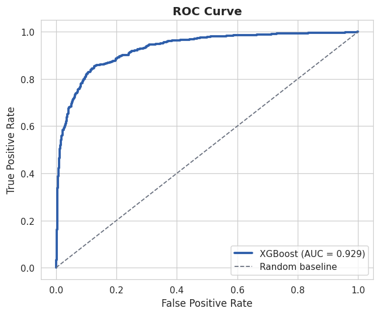
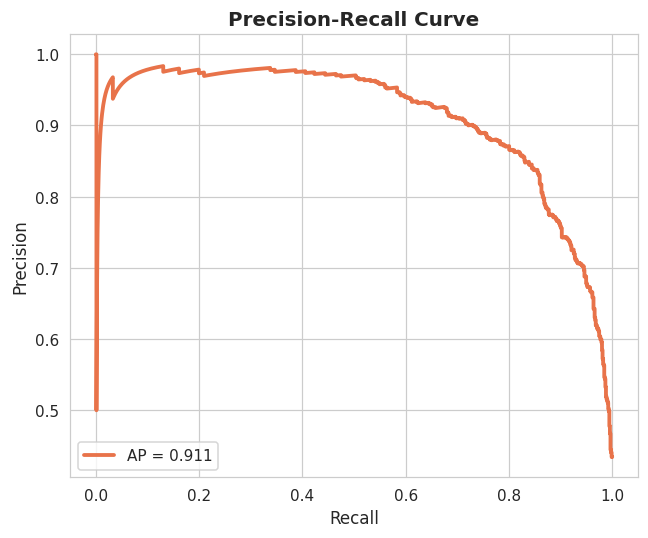
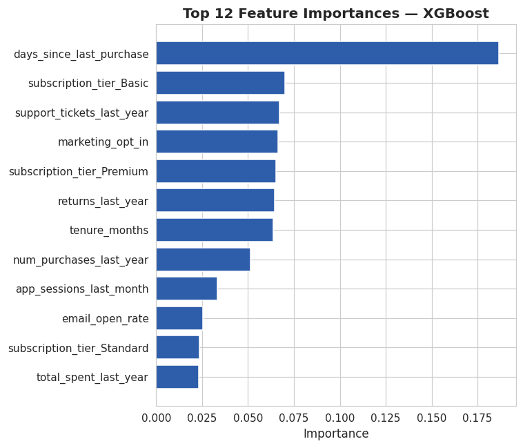

# DevelopersHub Customer Analytics

A customer churn analytics project built during a Data Science & Analytics Internship at **DevelopersHub Corporation**. It covers the full pipeline from exploratory data analysis through classification modeling to an interactive dashboard, using a synthetic customer dataset designed to reflect realistic purchase, demographic, and engagement patterns.

> **Note:** The dataset used here (`data/customer_data.csv`) is synthetically generated (see [`src/generate_data.py`](src/generate_data.py)) to demonstrate the analysis and modeling workflow. It is not real customer data from DevelopersHub Corporation or any other company.

## Project Summary

- Performed EDA and statistical analysis on **10,500 synthetic customer records** covering demographics, purchase history, and engagement metrics
- Compared three classification models for churn prediction; the best model (**XGBoost**) achieved **86.4% test accuracy** and **0.929 ROC-AUC**
- Built automated, interactive reporting via a **Streamlit + Plotly dashboard** with live churn prediction
- Generated all diagnostic visualizations (confusion matrix, ROC/PR curves, feature importance) with **Matplotlib** and **Seaborn**

## Repository Structure

```
developershub-customer-analytics/
├── data/
│   └── customer_data.csv              # Synthetic dataset (10,500 rows)
├── notebooks/
│   ├── customer_eda.ipynb             # Full EDA workflow
│   └── model_training_evaluation.ipynb # Model training & comparison notebook
├── src/
│   ├── generate_data.py               # Synthetic data generator
│   ├── preprocessing.py               # Shared preprocessing pipeline
│   ├── train_model.py                 # Trains & compares 3 classifiers
│   └── evaluate_model.py              # Generates evaluation plots & report
├── dashboard/
│   └── app.py                         # Streamlit dashboard
├── models/                            # Saved model + preprocessor artifacts
├── reports/
│   ├── figures/                       # Generated PNG charts
│   └── model_evaluation_report.txt    # Text classification report
├── requirements.txt
└── README.md
```

## Dataset

The synthetic dataset includes 19 features across three categories:

| Category | Features |
|---|---|
| **Demographics** | age, gender, region, annual_income |
| **Purchase history** | tenure_months, subscription_tier, num_purchases_last_year, avg_order_value, total_spent_last_year, days_since_last_purchase, returns_last_year |
| **Engagement** | email_open_rate, app_sessions_last_month, avg_session_duration_min, support_tickets_last_year, loyalty_points, referral_count, marketing_opt_in |

**Target:** `churned` (binary) — generated from a realistic combination of the above features, including genuine non-linear interaction effects (e.g., low engagement is a much stronger churn signal for customers in their first 6 months than for established ones), plus injected label noise so the classification task is learnable but not trivially separable. A small amount of missingness (1.5–3.2%) is also injected into a few columns to simulate real-world data collection gaps.

## Exploratory Data Analysis

The full EDA workflow is in [`notebooks/customer_eda.ipynb`](notebooks/customer_eda.ipynb) and covers:

- Data quality checks (missing values, duplicates, value-range sanity checks)
- Univariate analysis of demographics, purchase behavior, and engagement metrics
- Bivariate analysis of each feature against churn
- Correlation analysis across all numeric features
- A summary of the key churn drivers that motivate the modeling approach

**Key EDA findings:**
1. **Recency is king** — `days_since_last_purchase` is the strongest single churn signal
2. **Engagement matters more for new customers** — low email open rate / app usage predicts churn much more strongly in a customer's first 6 months than later on (a genuine interaction effect, not just a main effect)
3. **Subscription tier matters** — Basic-tier customers churn noticeably more than Premium
4. **Returns and support tickets compound with low purchase activity** — a support ticket from an otherwise-active customer is a weaker signal than one from a disengaged customer

## Modeling Approach & Results

Three classifiers were trained and compared on an 80/20 train-test split (stratified by churn), using a shared `ColumnTransformer` preprocessing pipeline (median/most-frequent imputation, standard scaling, one-hot encoding):

| Model | Accuracy | Precision | Recall | F1 Score | ROC-AUC |
|---|---|---|---|---|---|
| **XGBoost** | **86.4%** | 85.9% | 82.2% | 84.0% | **0.929** |
| Logistic Regression | 85.0% | 81.7% | 84.4% | 83.1% | 0.927 |
| Random Forest | 84.7% | 83.2% | 81.3% | 82.2% | 0.920 |

**XGBoost was selected as the final model.** It outperforms plain Logistic Regression because several of the strongest churn relationships in this data are interaction effects (engagement × tenure, returns × tenure) rather than simple linear effects — structure that tree-based ensembles can capture but linear models cannot.

5-fold cross-validation on the training set confirms this isn't a lucky split: XGBoost's CV accuracy is 84.9% ± 0.23%, the tightest spread of the three models.

### Confusion Matrix


### ROC Curve


### Precision-Recall Curve


### Feature Importance


`days_since_last_purchase` dominates as the most important feature, consistent with the EDA, followed by subscription tier, support tickets, marketing opt-in, and returns.

## Dashboard

The Streamlit dashboard ([`dashboard/app.py`](dashboard/app.py)) has four pages:

- **Overview** — churn distribution, churn rate by tier/region, age distribution, and an engagement-vs-spend scatter plot, all filterable by region, subscription tier, and age range
- **Customer Explorer** — searchable/filterable customer table with feature-vs-churn box plots
- **Churn Prediction** — a live prediction form: enter a customer profile and get a real-time churn probability from the trained XGBoost model, shown as a gauge chart
- **Model Performance** — the model comparison table, accuracy/ROC-AUC bar charts, and the feature importance chart, all rendered live from the saved model artifacts

## Setup & Usage

### 0. Push to GitHub (first time only)

This project is already a git repository with an initial commit. To publish it to GitHub:

```bash
# Create a new repository named "developershub-customer-analytics" on GitHub first
# (via github.com/new), then run:
git remote add origin https://github.com/<your-username>/developershub-customer-analytics.git
git push -u origin main
```

### 1. Install dependencies

```bash
pip install -r requirements.txt
```

### 2. (Optional) Regenerate the synthetic dataset

A pre-generated dataset is already included at `data/customer_data.csv`. To regenerate it (or generate a fresh sample):

```bash
python src/generate_data.py
```

### 3. Train the models

```bash
python src/train_model.py
```

This trains Logistic Regression, Random Forest, and XGBoost, compares them, and saves the best model + preprocessor to `models/`.

### 4. Generate evaluation plots

```bash
python src/evaluate_model.py
```

Saves the confusion matrix, ROC curve, precision-recall curve, and feature importance chart to `reports/figures/`.

### 5. Launch the dashboard

```bash
streamlit run dashboard/app.py
```

Then open the local URL Streamlit prints (typically `http://localhost:8501`).

### 6. Explore the notebooks

```bash
jupyter notebook notebooks/
```

Open `customer_eda.ipynb` for the full EDA walkthrough, or `model_training_evaluation.ipynb` for the model training and comparison walkthrough.

## Tech Stack

- **Data analysis:** Python, pandas, NumPy
- **Visualization:** Matplotlib, Seaborn, Plotly
- **Machine learning:** Scikit-learn, XGBoost
- **Dashboard:** Streamlit
- **Environment:** Jupyter Notebook

## Skills Demonstrated

- Exploratory data analysis and statistical reasoning on a 10,000+ record dataset
- Feature engineering and preprocessing pipeline design (imputation, scaling, encoding)
- Classification model training, comparison, and selection across multiple algorithms
- Model evaluation using accuracy, precision, recall, F1, ROC-AUC, and cross-validation
- Data visualization for both static reporting (Matplotlib/Seaborn) and interactive dashboards (Plotly/Streamlit)
- Writing modular, reusable Python (shared preprocessing across notebooks, scripts, and dashboard)

---

*Built by Muhammad Aamir as part of a Data Science & Analytics Internship at DevelopersHub Corporation.*
